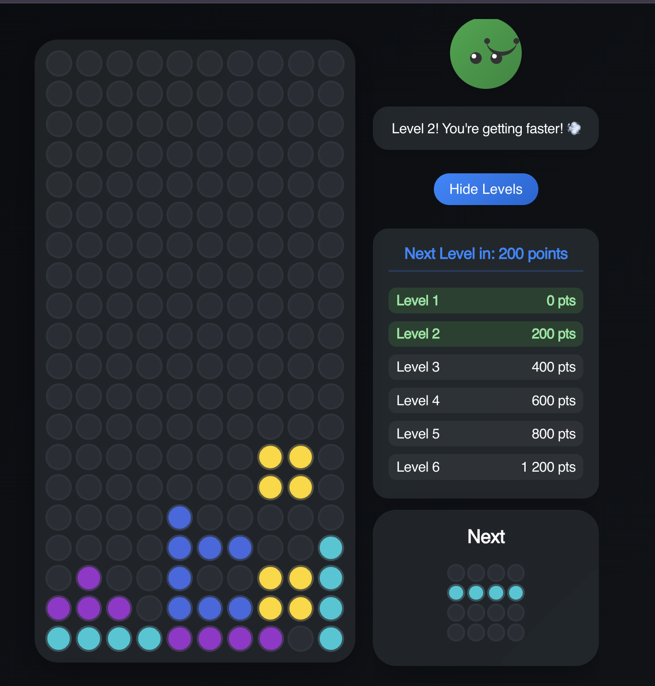

# Bubble Tetris by AI



[Live Demo]()

A modern implementation of the classic Tetris game featuring a unique bubble design, built with Next.js and TypeScript.

## Description

Bubble Tetris is a fresh take on the traditional Tetris game, featuring bubble-shaped blocks, smooth animations, and a modern dark theme interface. The game includes a helpful character that reacts to your gameplay and provides feedback.

## Features

- 🎮 Classic Tetris gameplay mechanics
- 🫧 Unique bubble-style design
- 🌗 Modern dark theme interface
- 🎯 Score and level progression system
- 👾 Interactive helper character with emotions
- 🔮 Next piece preview window
- 💫 Bubble explosion animations
- 📱 Responsive design for all devices
- ⚡ Fast-paced gameplay with increasing difficulty

## Tech Stack

- Next.js 14
- TypeScript
- SCSS Modules
- React Hooks

## Installation

1. Clone the repository:

```bash
git clone https://github.com/your-username/tetris-ai.git
cd tetris-ai
```

2. Install dependencies:

```bash
npm install
```

3. Run the development server:

```bash
npm run dev
```

4. Open [http://localhost:3000](http://localhost:3000) in your browser

## Game Controls

- ⬅️ Left Arrow: Move piece left
- ➡️ Right Arrow: Move piece right
- ⬇️ Down Arrow: Move piece down faster
- ⬆️ Up Arrow or Space: Rotate piece
- New Game button: Start a new game
- Show Levels button: Display level progression

## Scoring System

- Clear one line: 100 points
- Level progression:
  - Level 1: 0 points
  - Level 2: 200 points
  - Level 3: 400 points
  - Level 4: 600 points
  - Level 5: 800 points
  - Level 6: 1,200 points
  - Level 7: 1,600 points
  - Level 8: 2,000 points
  - Level 9: 2,400 points
  - Level 10: 3,600 points

## Project Structure

```
bubble-tetris/
├── src/
│   ├── app/
│   │   ├── layout.tsx
│   │   ├── page.tsx
│   │   ├── globals.scss
│   │   └── fonts.scss
│   ├── components/
│   │   ├── Tetris.tsx
│   │   ├── Tetris.module.scss
│   │   ├── GameHelper.tsx
│   │   ├── GameHelper.module.scss
│   │   ├── NextPiece.tsx
│   │   ├── NextPiece.module.scss
│   │   ├── BubbleExplosion.tsx
│   │   └── BubbleExplosion.module.scss
│   └── types/
│       └── tetris.ts
├── public/
├── package.json
└── README.md
```

## Development

The game is built using modern React practices and TypeScript for type safety. Key features include:

- Custom hooks for game logic
- SCSS modules for styled components
- Responsive design principles
- Component-based architecture
- Type-safe development with TypeScript

## Building for Production

```bash
npm run build
npm start
```

## Browser Support

The game is optimized for modern browsers and supports:

- Chrome (latest)
- Firefox (latest)
- Safari (latest)
- Edge (latest)

## Contributing

Contributions are welcome! Please feel free to submit a Pull Request.

## License

This project is licensed under the MIT License.
